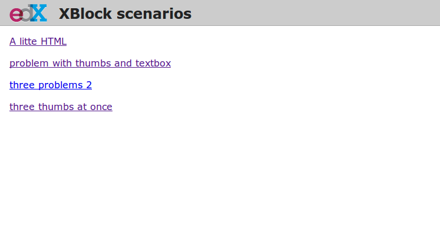
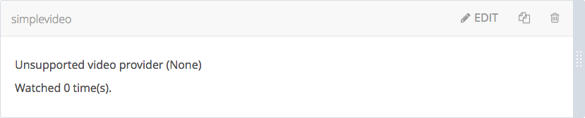
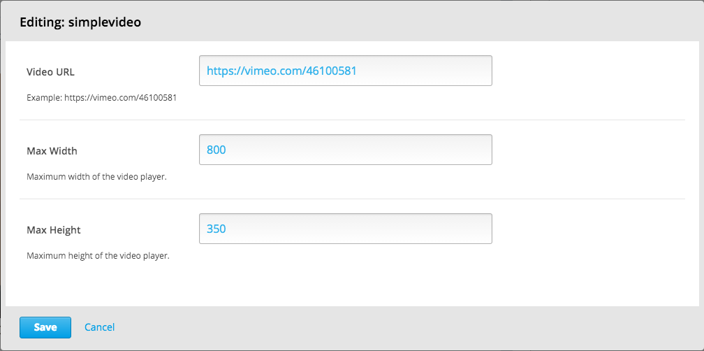

========
Tutorial
========

This tutorial will walk you through the creation of a custom XBlock. It will allow to display a
video in a course, using `oEmbed <http://oembed.com/>`_, and record when the student finishes
watching it.

To give you a sneak peek, the goal is to generate this:

.. image:: images/simplevideo_finished.png

Based on this: ::

    <vertical_demo>
        <simplevideo href="https://vimeo.com/46100581" maxwidth="800" />
        <html_demo>
Rate the video:
</html_demo>
        <thumbs />
    </vertical_demo>

Setup
=====

Getting help
------------

If you get stuck, or have any question, and can't find the answer in this documentation, don't
hesitate to ask for help. You can either:

* Subscribe to the `edx-xblock@ mailing list <https://groups.google.com/forum/#!forum/edx-xblock>`_
  (be sure to search for your question first before posting!)
* Join the `#edx-code IRC channel on Freenode <http://webchat.freenode.net/?channels=edx-code>`_

Installing XBlock SDK
---------------------

XBlock SDK runs on Python 2.7.

1. Grab the source code for XBlock SDK at https://github.com/edx/xblock-sdk: ::

    $ git clone https://github.com/edx/xblock-sdk.git
    $ cd xblock-sdk

2. (Optional) Create and activate a virtualenv to work in: ::

    $ mkvirtualenv xblock-sdk

3. Install the requirements (you may need to sudo this if you don't use virtualenv): ::

    $ pip install -r requirements.txt

4. Create and sync the sqllite DB: ::

    $ python manage.py syncdb

5. Run the django development server: ::

    $ python manage.py runserver

You should be able to visit http://127.0.0.1:8000/ and see the following interface showing up:

Creating a new XBlock
---------------------

The simplest way to get started on a new XBlock is to use the `script/startnew.py` script from the
`xblock-sdk` repo. It asks for the name of your XBlock and creates a new folder containing a
working barebones XBlock with heavily commented code and all the required boilerplate.

For this tutorial however, we will be creating our custom XBlock manually.

First create a folder for you custom XBlock *outside* of the `xblock-sdk` repository
you just cloned, and initialize a new git repository in it: ::

    $ cd ..
    $ mkdir xblock-simplevideo
    $ cd xblock-simplevideo/
    $ git init
    Initialized empty Git repository in /home/antoviaque/prog/edx/xblock-simplevideo/.git/

Class & attributes (data schema)
================================

We are defining the `<simplevideo>` XBlock, which we want to allow to accept different attributes: ::

    <simplevideo href="https://vimeo.com/46100581" maxwidth="800" maxheight="450" />

We will create a subclass of the `XBlock` class that will control our `<simplevideo>` tag.
Let's call it `SimpleVideoBlock` and define it inside `xblock-simplevideo/simplevideo.py`.

Our `<simplevideo>` tag will accept three attributes: `href`, `maxwidth`, and `maxheight`.
We will define them as attributes of the `SimpleVideoBlock` class.
The `xblock-simplevideo/simplevideo.py` should look like this: ::

    from xblock.core import XBlock
    from xblock.fields import Scope, Integer, String

    class SimpleVideoBlock(XBlock):
        """
        An XBlock providing oEmbed capabilities for video
        """

        href = String(help="URL of the video page at the provider", default=None, scope=Scope.content)
        maxwidth = Integer(help="Maximum width of the video", default=800, scope=Scope.content)
        maxheight = Integer(help="Maximum height of the video", default=450, scope=Scope.content)

We specify their type `String`/`Integer`, the default values in case the attributes are missing, and
a scope.

All three attributes here use the predefined `content` scope, which indicates a definition from the
content creator, which is not specific to a given user. See the documentation about `fields
<guide/xblock.html#fields>`_ for more details.

View: HTML, templates & fragments
=================================

To be able to embed the video from https://vimeo.com/46100581 on the course, the XBlock will need to
retrieve the HTML code of the video player from Vimeo. To do this, we use `oEmbed
<http://oembed.com/>`_, which allows to obtain information about a given URL through an `API
<https://developer.vimeo.com/apis/oembed>`_. For example:
http://vimeo.com/api/oembed.json?url=https://vimeo.com/46100581.

We declare a view, which will fetch the HTML code from the oEmbed provider, based on the value of
the `SimpleVideoBlock.href` attribute. The view is defined as a method on the XBlock,
`SimpleVideoBlock.student_view()`: ::

    import pkg_resources
    import requests

    from urlparse import urlparse

    from xblock.core import XBlock
    from xblock.fields import Scope, Integer, String
    from xblock.fragment import Fragment

    class SimpleVideoBlock(XBlock):
        [...]

        def student_view(self, context):
            """
            Create a fragment used to display the XBlock to a student.
            `context` is a dictionary used to configure the display (unused).

            Returns a `Fragment` object specifying the HTML, CSS, and JavaScript
            to display.
            """
            provider, embed_code = self.get_embed_code_for_url(self.href)

            # Load the HTML fragment from within the package and fill in the template
            html_str = pkg_resources.resource_string(__name__, "static/html/simplevideo.html")
            frag = Fragment(unicode(html_str).format(self=self, embed_code=embed_code))

            return frag

        def get_embed_code_for_url(self, url):
            """
            Get the code to embed from the oEmbed provider.
            """
            hostname = url and urlparse(url).hostname
            # Check that the provider is supported
            if hostname == 'vimeo.com':
                oembed_url = 'http://vimeo.com/api/oembed.json'
            else:
                return hostname, '
Unsupported video provider ({0})
'.format(hostname)

            params = {
                'url': url,
                'format': 'json',
                'maxwidth': self.maxwidth,
                'maxheight': self.maxheight,
                'api': True
            }

            try:
                r = requests.get(oembed_url, params=params)
                r.raise_for_status()
            except Exception as e:
                return hostname, '
Error getting video from provider ({error})
'.format(error=e)
            response = r.json()

            return hostname, response['html']

The HTML we obtained from the provider is interpolated into a HTML template
(`simplevideo/static/html/simplevideo.html`). The output is used to build a `Fragment
<guide/fragment.html>`_, which is being returned for inclusion on a page.

Static files
------------

To load static resources, we are using Python's `pkg_resources module
<http://pythonhosted.org/distribute/pkg_resources.html>`_. The default directory structure makes
use of individual `css`, `html`, and `js` folders. This structure is not mandatory though,
each XBlock can choose its own, as long as it specifies the correct paths in the call to
`pkg_resources`.

Here we only need a very simple template, which we create in
`xblock-simplevideo/static/html/simplevideo.html`: ::

    

      {embed_code}
    

This template is not strictly necessary here, as we only use it to include the HTML
returned by the oEmbed provider in a `
`, but it will be handy to add additional HTML to our
XBlock later on. It also allows you to see how static files and templates are loaded from the
`xblock-simplevideo/static/` subfolders, using the `pkg_resources
<http://pythonhosted.org/distribute/pkg_resources.html>`_ module. Later on, we will use the same
method to load CSS and JavaScript files.

Loading an example from the workbench (scenarios)
=================================================

How do we actually use the `<simplevideo>` tag we just defined? Let's say that we are producing
a new course, and we want to display the video from https://vimeo.com/46100581 to the students. This
could be done using the following markup ::

    <vertical_demo>
        <simplevideo href="https://vimeo.com/46100581" maxwidth="800" />
        <html_demo>
Rate the video:
</html_demo>
        <thumbs />
    </vertical_demo>

This is how courses are built - such markup constitute the basic static building block for course
content. The instructor combines different XBlocks like this, to eventually have the whole course
described in a XBlock document tree.

Here, we display three elements, aligned vertically using the `<vertical>` XBlock. First there is
our video, using the `<simplevideo>` tag, then an HTML `
` tag, and then a `<thumbs>` XBlock, to
let the students rate the video by clicking on thumbs (up/down).

Where this markup would be specified is actually independent from XBlock - the instantiation of
XBlocks and the call of block methods/views is performed by a *runtime*. However, the workbench
provides a quick way to load a set of "usages" (individual instances of XBlocks) in a scenario. To
define a scenario for the workbench, add the following method to the `SimpleVideoBlock` class: ::

    @staticmethod
    def workbench_scenarios():
        """A canned scenario for display in the workbench."""
        return [
            ("simple video",
            """
            <vertical_demo>
                <simplevideo href="https://vimeo.com/46100581" maxwidth="800" />
                <html_demo>
Rate the video:
</html_demo>
                <thumbs />
            </vertical_demo>
            """)
        ]

The attributes, like `href`, are mapped to attributes of the XBlock class and automatically
initialized to the provided value. It allows you to specify which video should be displayed in this
particular scenario.

Registering an XBlock (entry point)
===================================

XBlocks are loaded dynamically as plugins, using the `entry_points mechanism of setuptools
<http://pythonhosted.org/distribute/setuptools.html#dynamic-discovery-of-services-and-plugins>`_.
XBlocks are registered by looking up entry points with the name `xblock.v1`. The workbench will call
the `workbench_scenarios()` method on each registered XBlock, to populate the list of scenarios
displayed on its homepage.

Create the following `xblock-simplevideo/setup.py` file: ::

    from setuptools import setup

    setup(
        name='xblock-simplevideo',
        version='0.1',
        description='SimpleVideo XBlock Tutorial Sample',
        py_modules=['simplevideo'],
        install_requires=['XBlock'],
        entry_points={
            'xblock.v1': [
                'simplevideo = simplevideo:SimpleVideoBlock',
            ]
        }
    )

Then create a file `xblock-simplevideo/requirements.txt` to allow to register the package,
as well as automatically install other dependencies such as the `requests` module we
use to query the oEmbed provider: ::

    requests==1.2.2
    -e .

The '-e' option tells to always use the latest files from the development directory, instead of
packaging the files when you run the command.

Then run `pip` to register the `xblock-simplevideo` package and allow XBlock to find the
entry point: ::

    $ pip install -r requirements.txt

Now, (re)start the workbench server: ::

    $ cd ../xblock-sdk
    $ python manage.py runserver

You should see the new "*simple video*" scenario appearing in the list from http://localhost:8000/
(highlighted in yellow on the screenshot - it will appear just like the other links for you):

.. image:: images/workbench_home_simplevideo.png

When you click on it, you should see the video appearing, along with the thumb block to rate the
video:

.. image:: images/simplevideo_scenario1.png

Adding CSS styling
==================

Let's say we want to add a small margin above and below every video. We'll do this with CSS.
Create the file `xblock-simplevideo/static/css/simplevideo.css` and put the following code in it: ::

    .simplevideo {
        margin: 10px 0;
    }

Then edit the `SimpleVideoBlock.student_view()` method: ::

    class SimpleVideoBlock(XBlock):
        [...]

        def student_view(self, context):
            [...]
            provider, embed_code = self.get_embed_code_for_url(self.href)

            # Load the HTML fragment from within the package and fill in the template
            html_str = pkg_resources.resource_string(__name__, "static/html/simplevideo.html")
            frag = Fragment(unicode(html_str).format(self=self, embed_code=embed_code))

            # Load CSS
            css_str = pkg_resources.resource_string(__name__, "static/css/simplevideo.css")
            frag.add_css(unicode(css_str))

            return frag

Reload http://localhost:8000/scenario/simplevideo.0/. Tadaa! You should now see bigger margins on
the top & bottom of the video.

JavaScript & Ajax calls
=======================

Now, something fancier. We want to keep track of whether a student has finished watching the video -
and if he did, how many times. We'll use JavaScript to make an Ajax call to the server when the
video is finished. For this, we load both Vimeo's JavaScript API library (`Froogaloop
<https://developer.vimeo.com/player/js-api>`_), as well as our own JavaScript file,
`static/js/src/simplevideo.js`: ::

    class SimpleVideoBlock(XBlock):
        [...]
        def student_view(self, context):
            [...]
            # Load CSS
            css_str = pkg_resources.resource_string(__name__, "static/css/simplevideo.css")
            frag.add_css(unicode(css_str))

            # Load JS
            if provider == 'vimeo.com':
                js_str = pkg_resources.resource_string(__name__, "static/js/lib/froogaloop.min.js")
                frag.add_javascript(unicode(js_str))
                js_str = pkg_resources.resource_string(__name__, "static/js/src/simplevideo.js")
                frag.add_javascript(unicode(js_str))
                frag.initialize_js('SimpleVideoBlock')

            return frag

Update the template we created before to display the number of times the student has finished
watching the video: ::

    

      {embed_code}
      
Watched {self.watched} time(s).
    

You can download the Froogaloop library from `http://a.vimeocdn.com/js/froogaloop2.min.js`: ::

    $ mkdir -p static/js/lib
    $ wget -O static/js/lib/froogaloop.min.js http://a.vimeocdn.com/js/froogaloop2.min.js

Create the `xblock-simplevideo/static/js/src/simplevideo.js` file: ::

    function SimpleVideoBlock(runtime, element) {
        var iframe = $('.simplevideo iframe'),
            player = $f(iframe[0]),
            watched_status = $('.simplevideo .status .watched');

        function on_finish(id) {
            $.ajax({
                type: "POST",
                url: runtime.handlerUrl(element, 'mark_as_watched'),
                data: JSON.stringify({watched: true}),
                success: function(result) {
                    watched_status.text(result.watched);
                }
            });
        }

        player.addEvent('ready', function() {
            player.addEvent('finish', on_finish);
        });
    }

Here, we:

* Locate the `iframe`,
* Pass it to the Froogaloop library to get the `player` object,
* Capture `finish` events from the `player` once it is ready,
* Make an Ajax call to the `SimpleVideoBlock.mark_as_watched()` method when it is fired (we obtain
  the URL for the Ajax call through the `runtime.handlerUrl()` method)

Also notice that:

* The `SimpleVideoBlock.mark_as_watched()` method gets the data passed to the Ajax call,
  deserialized.
* The `success()` callback is passed the return value from the `mark_as_watched()` method
* The `watched` attribute from the returned result is used to update a new field, `$('.simplevideo
  .status .watched')`.

And finally, add the `mark_as_watched()` method to the XBlock, along with a new `watched` attribute,
which will store the number of times the user has completed watching the video: ::

    import logging
    log = logging.getLogger(__name__)
    [...]

    class SimpleVideoBlock(XBlock):
        [...]
        watched = Integer(help="How many times the student has watched it?", default=0, scope=Scope.user_state)
        [...]

        @XBlock.json_handler
        def mark_as_watched(self, data, suffix=''):
            """
            Called upon completion of the video.
            """
            if not data.get('watched'):
                log.warn('not watched yet')
            else:
                self.watched += 1

            return {'watched': self.watched}

You should now be getting this:

.. image:: images/simplevideo_finished.png

**Important note**: It seems that the Vimeo JS API calls are broken with Firefox - until this is
fixed, test with Chrome/Chromium instead.

Deploying to edx-platform
=========================

To use the `SimpleVideoBlock` in the Studio and LMS, there are three things you need to do:

1. Make sure the `ALLOW_ALL_ADVANCED_COMPONENTS` feature flag is set to `True`;
2. Install `xblock-simplevideo` into the virtual environment you are running the studio from;
3. In the Studio, got to `Settings -> Advanced Settings` and add `"simplevideo"` to
   the `advanced_modules` list.

Assuming you are running edX from the devstack, this is how you can do this:

1. `ALLOW_ALL_ADVANCED_COMPONENTS` is set to `True` by default in the devstack environment,
   so this part is already taken care of.

2. The easiest way to do this is to make your local folder containing the simplevideo code
   available to the devstack machine. You can do that by adding the following line to your
   `Vagrantfile` and restarting the machine: ::

    config.vm.synced_folder "/path/to/xblock-simplevideo", "/edx/xblock-simplevideo", create: true, nfs: true

   Then SSH into the devstack machine and install `xblock-simplevideo` to the edxapp
   environment using `pip`: ::

    $ sudo su edxapp
    $ cd /edx/xblock-simplevideo
    $ pip install -r requirements.txt

3. Restart the Studio, navigate to `Settings -> Advanced Settings` in your course,
   and set the `advanced_modules` field to `["simplevideo"]`.

You should now be able to see an "advanced" button under "Add New Component" when you are
editing a unit. If you click the button, you will be able to add the "simplevideo" XBlock
to your course.

At this point, the block is unusable because there is no way to set the `href`, `maxwidth`,
and `maxheight` attributes. We need to implement the studio view to be able to set the
attributes through the Studio UI.

The Studio view
===============

To implement the edit UI, we need add the `studio_view` method to the
`SimpleVideoBlock` class: ::

    def studio_view(self, context):
        """
        Create a fragment used to display the edit view in the Studio.
        """
        html_str = pkg_resources.resource_string(__name__, "static/html/simplevideo_edit.html")
        href = self.href or ''
        frag = Fragment(unicode(html_str).format(href=href, maxwidth=self.maxwidth, maxheight=self.maxheight))

        return frag

The `studio_view` method looks similar to the `student_view` method. It constructs a fragment
from a static template. The `static/html/simplevideo_edit.html` template contains the form
the is displayed to the user when editing the block in the Studio: ::

    

      <ul class="list-input settings-list">
        <li class="field comp-setting-entry is-set">
          

            <label class="label setting-label" for="href">Video URL</label>
            <input class="input setting-input" name="href" id="href" value="{href}" type="text" />
          

          Example: https://vimeo.com/46100581
        </li>
        <li class="field comp-setting-entry is-set">
          

            <label class="label setting-label" for="maxwidth">Max Width</label>
            <input class="input setting-input" name="maxwidth" id="maxwidth" value="{maxwidth}" type="text" />
          

          Maximum width of the video player.
        </li>
        <li class="field comp-setting-entry is-set">
          

            <label class="label setting-label" for="maxheight">Max Height</label>
            <input class="input setting-input" name="maxheight" id="maxheight" value="{maxheight}" type="text" />
          

          Maximum height of the video player.
        </li>
      </ul>
      

        <ul>
          <li class="action-item">
            <a href="#" class="button action-primary save-button">Save</a>
          </li>
          <li class="action-item">
            <a href="#" class="button cancel-button">Cancel</a>
          </li>
        </ul>
      

    

We used some common Studio CSS classes to style the form so that it feels consistent
to the rest of the Studio.

At this point you should be able to see the form when clicking the "edit" button
on the simplevideo block.

The "Save" button doesn't do anything yet. In order to get it to actually save the
attributes, we need to add another JSON handler function to the `SimpleVideoBlock`
class and add some JavaScript to wire it up.

Let's call the JSON handler `studio_submit`. It simply sets the attributes to the values
it receives in the POST request. It would be good to have some validation logic in
place, but we'll keep it simple for the tutorial: ::

    @XBlock.json_handler
    def studio_submit(self, data, suffix=''):
        """
        Called when submitting the form in Studio.
        """
        self.href = data.get('href')
        self.maxwidth = data.get('maxwidth')
        self.maxheight = data.get('maxheight')

        return {'result': 'success'}

The `static/js/src/simplevideo_edit.js` JavaScript file should look like this: ::

    function SimpleVideoEditBlock(runtime, element) {
      $(element).find('.save-button').bind('click', function() {
        var handlerUrl = runtime.handlerUrl(element, 'studio_submit');
        var data = {
          href: $(element).find('input[name=href]').val(),
          maxwidth: $(element).find('input[name=maxwidth]').val(),
          maxheight: $(element).find('input[name=maxheight]').val()
        };
        $.post(handlerUrl, JSON.stringify(data)).done(function(response) {
          window.location.reload(false);
        });
      });

      $(element).find('.cancel-button').bind('click', function() {
        runtime.notify('cancel', {});
      });
    }

We attach a click listener that POSTs the attribute values to our JSON handler
when clicking the "Save" button. We also attach a click listener to the cancel button,
which calls `runtime.notify('cancel', {})` which causes the modal window with the form
to close.

We need to add the JavaScript to the fragment that is returned from the `studio_view` method: ::

    def studio_view(self, context):
        """
        Create a fragment used to display the edit view in the Studio.
        """
        html_str = pkg_resources.resource_string(__name__, "static/html/simplevideo_edit.html")
        href = self.href or ''
        frag = Fragment(unicode(html_str).format(href=href, maxwidth=self.maxwidth, maxheight=self.maxheight))

        js_str = pkg_resources.resource_string(__name__, "static/js/src/simplevideo_edit.js")
        frag.add_javascript(unicode(js_str))
        frag.initialize_js('SimpleVideoEditBlock')

        return frag

The simplevideo block is now fully functional.

Source repository
=================

A repository containing the code from this tutorial can be found at
https://github.com/antoviaque/xblock-simplevideo.
